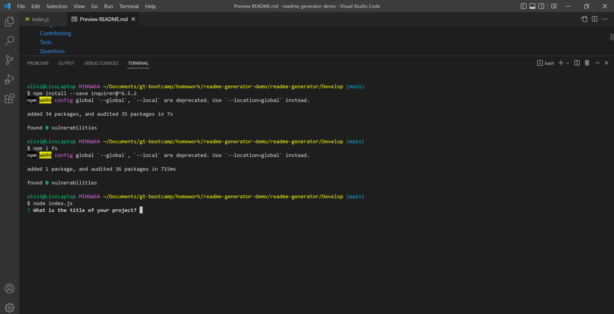
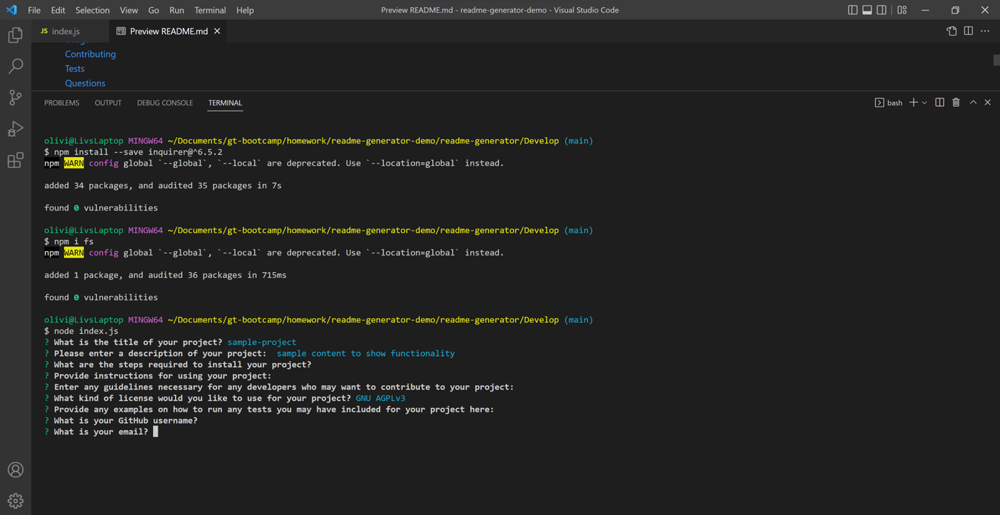

# README Generator 

## Description
Using the inquirer package, the user is prompted with a series of questions relating to their project. The answer to these question are then stored and used to fill a prewritten template. the fs package is then used to create a file named 'README' which is then filled with the information from the completed template.

The user is asked for the title of their project, a description of the project, any necessary steps to install the project, instructions for using the project, guidelines for any developers who may want to contribute to the project, what kind of license the project uses, examples of how to run any tests they may have created for the project, the creator's GitHub username, and the creator's email. All but one prompt is created to be a free response question, allowing the user to answer as they wish. The answers to these question are then stored into their appropriate sections of the README file template. The prompt for the license type, however, gives the user a list of four different license options to choose from. The user can navigate between different options using the up and down arrows on their keyboard. Once the license selection is made, the stored notice, link and badge are added to the README file.
  
## Installation
The user must install both the inquirer and fs packages in the 'Develop' folder before using this project. The inquirer package must be installed at version 6.5.2.
  
## Usage
After installing the necessary packages, the user must run the project in node. After answering each question, they must press the 'return' button to progress to the next prompt. When selecting the license type, the user will use the up and down arrow keys to navigate between options. After answering every question the README file will be created. 

[Video Demo of App](https://drive.google.com/file/d/19K3-rl0I1NrLF1v2HUSWkpKVYffDG5s5/view)
  
## Contact
oliviaguerra731@gmail.com  
GitHub: oguerra9
 
